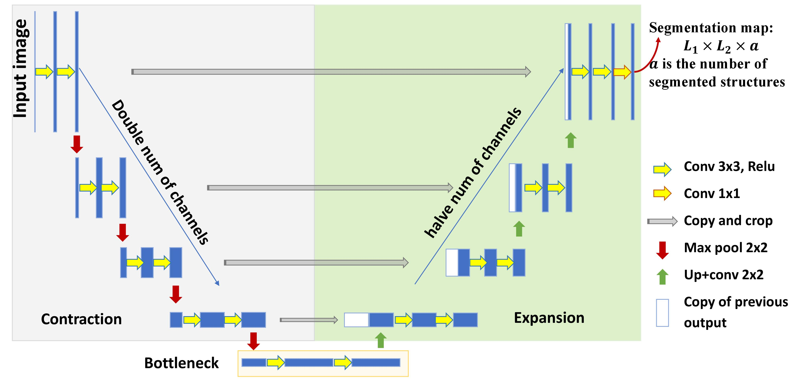
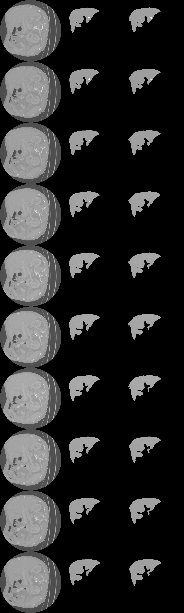
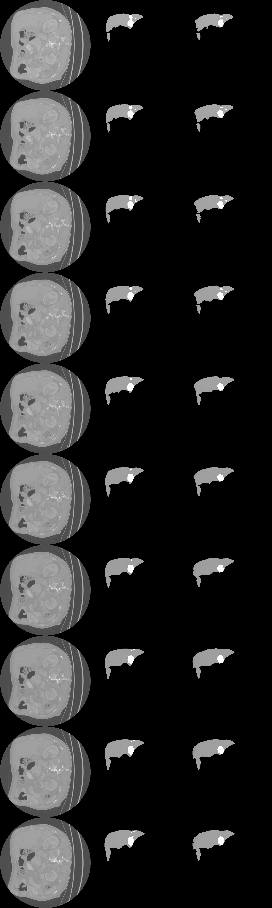
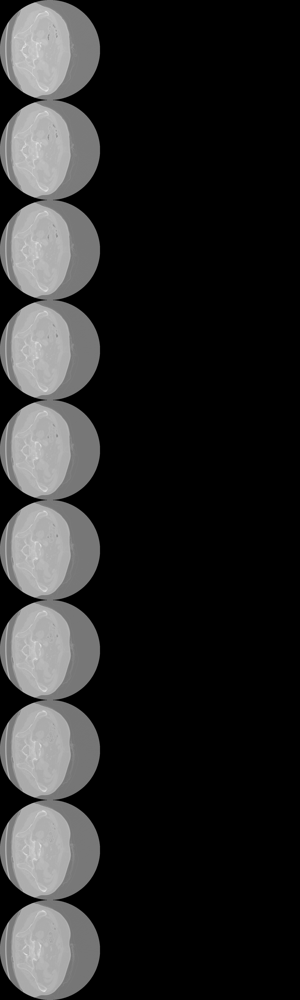
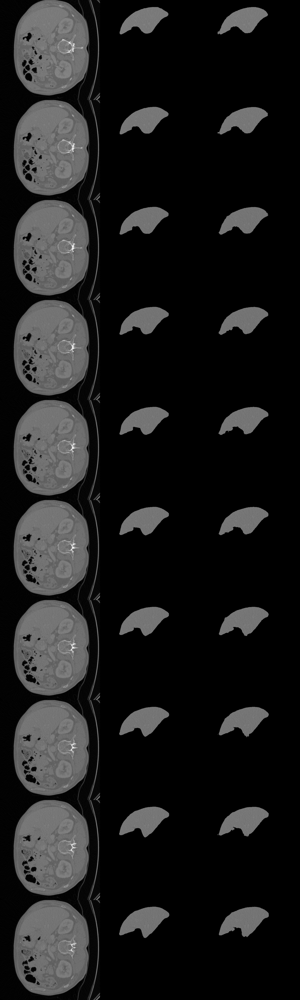
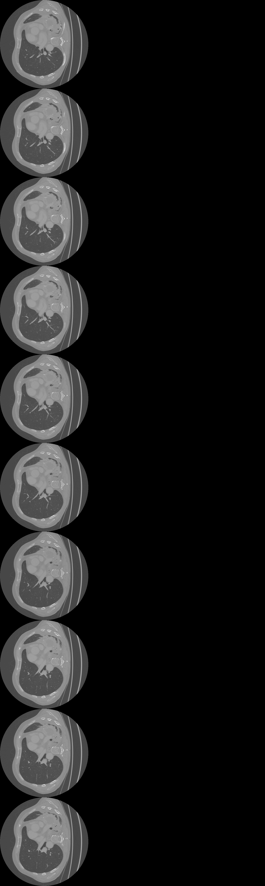
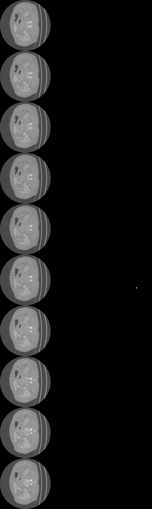

# U-Net Segmentation for Medical Images by Pytorch

This repository provides an **extremely simple code**  for Image Segmentation by [U-Net](http://lmb.informatik.uni-freiburg.de/people/ronneber/u-net/) using PyTorch. [Liver Tumor Segmentation Challenge (LiTS)](https://competitions.codalab.org/competitions/17094) dataset is used for demonstration.

---

## Overview

### Data & Structure
* Use open medical dataset [Liver Tumor Segmentation Challenge (LiTS)](https://competitions.codalab.org/competitions/17094) with no preprocessing required.

* The original dataset contains **131 train** & **70 test** 3D CT images in **.nii** format. The 3D image sizes are (512, 512, 74\~987), where slice number varies.

### Model

The U-Net is implemented by Pytorch for deep learning. This code is easy to visualize the architechture and convenient for changing your own dataset.

In this demonstration, LiTS has **grayscale inputs (CT images)** and **output (organ contours)** of 3 different classes: **liver, tumor, anthing else**

### Training

The model is trained for 5 epochs. After 5 epochs, calculated accuracy is about 0.97. Loss function is defined as the crossentropy.

---

## How to use

### Dependencies

This example code runs with the following libraries:

* Python 3.6  
* [PyTorch](https://pytorch.org/) >= 1.0.1
* [NiBabel](https://nipy.org/nibabel/) (to read *.nii* files)
* Matplotlib, Numpy, Scikit-Learn, Scikit-Image

### Computational device:
* at least 32Gb CPU memory
* at least 1 NVidia GPU with 11Gb (GPU) memory

### Run train_UNET.py

You will see the predicted results of test image in ....

### Results

Use the trained model to do segmentation on validation images, the result is statisfactory. Readers are encourage to play with the architectures with validation as a guide, and test their final model on the testing set.
[fig/batch_1354_display.png](./fig/batch_1354_display.png)

